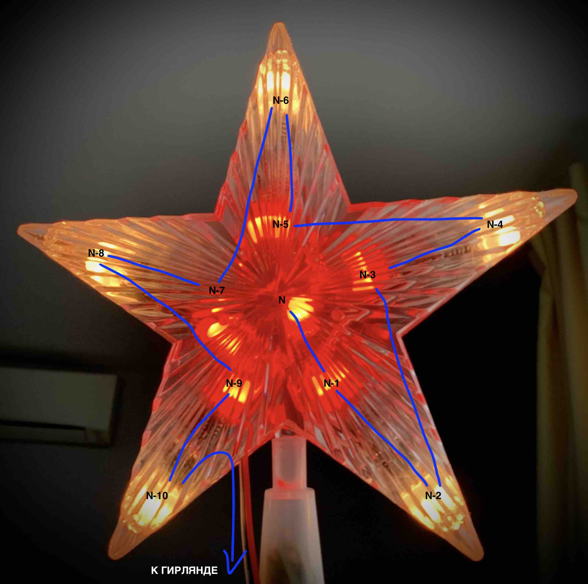
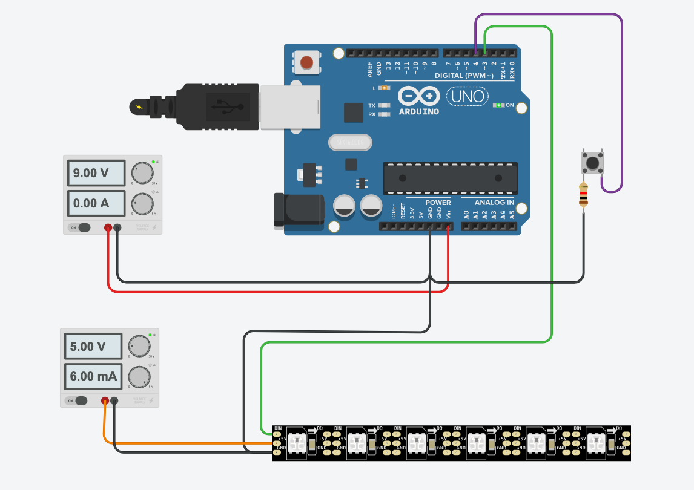

# Гирлянда для новогодней елки (2021)

[](https://github.com/sochkasov/christmas-tree-light-2018/actions/workflows/manual.yml)

Проект гирлянды для новогодней елки. Имеется 15 эффектов анимации свечения. Гирлянда может работать в 2 режимах:

- автоматическая смена эффектов
- ручной выбор (выбирается [кнопкой](#управление-при-помощи-кнопки-режимы-работы))

## Демонстрация работы

[Видео](https://youtu.be/UnmnpGUHGVY) демонстрирующее работу кода

## Порядок размещения светодиодов

Для получения ожидаемых результатов, важно правильно разместить светодиоды на елке. Для этого, разместите самый последние светодиоды на самом верху елки в звезде (покупалась недорого в Fixprice). У меня последний в цепочке светодиод находится в центре звезды. В проекте было использовано 11 светодиодов в звезде. Последовательность соединения показана на фотографии. Другие варианты размещения светодиодов и последовательность их соединения потребуют изменений в коде (функции star1()-star2() ). Для большей совместимости добавлен функционал, который позволяет, при использовании количества светодиодов, отличного от 11, все-же выделить звезду как отдельный объект и воспроизводить у нем анимации.



Далее гирлянду со светодиодами необходимо размещать по веткам елки по кругу, постепеннь спускаясь вниз. Т.е. размещайте ее как бы по спирали.

## Software

Код по сути является подобранными и доработанными примерами из библиотеки и сторонних проектов.
Писалось быстро для новогодней елки. В случае необходимости легко вносить изменения.

Проект переделан под Platformio (VSCode + Platformio). Старая версия проекта на Arduino IDE размещена в папке [DemoReel100](DemoReel100/)

Зависимости библиотек указаны в platformio.ini

## Hardware

### На базе Arduino

*смотри и выбирай при компиляции [env:megaatmega2560] в [platformio.ini](platformio.ini)*

В проекте использовалось:

- Arduino Mega 2560 (подойдет любая другая Arduino или ESP8266/ESP32)
- LED светодиоды WS2811, спаянные в гирлянду (69 штук в линию + 11 в звезде)

#### Схема подключения



### На базе ESP8266

*смотри и выбирай при компиляции [env:esp8266] в [platformio.ini](platformio.ini)*

Для работа данного варианта я использовал:

- плату NodeMCU 1.0
- LED так-же как в предыдущем случае

Схема включения аналогичная варианту на Arduino. Сигнальный провод гирлянды подключаем к D3, или другому выходу, который Вы определяете в коде.

## Управление при помощи кнопки (режимы работы)

Гирлянда может работать как в автоматическом режиме, так и с принудительным выбором эффекта.
Управление осуществляется при помощи нажатия кнопки.

**Быстрое нажатие** приводит к переключению в ручной режим и переключению эффекта на следующий.

**Двойное нажатие** включает автоматический режим смены эффектов. Время до включения следующего эффекта устанавливается в конфиге параметром ```TIME_FOR_1_EFFECT```.

Включение/выключение гирлянды осуществляется при помощи **долгого нажатия** кнопки.

## Настройка

В случае необходимости, в файле src/main.h необходимо поправить под свою конфигурацию следующие настройки

```c++
const int BUTTON_PIN = 4;           // pin, куда подключена кнопка управления
#define DATA_PIN    3               // pin куда подключается лента со светодиодами
//#define CLK_PIN   4               // ping для некоторых типов светодиодов (см. документацию FastLED)
#define LED_TYPE    WS2811          // тип светодиодов
#define COLOR_ORDER RGB             // [порядок цветов в светодиодах](https://github.com/FastLED/FastLED/wiki/Rgb-calibration)

#define NUM_LEDS_STAR    11         // количество светодиодов в звезде
#define NUM_LEDS_LINE    69         // количество светодиодов в линейке (без учета звезды)

const int TIME_FOR_1_EFFECT = 15;   // скорость переключения эффектов в автоматическом режиме
#define BRIGHTNESS          255     // максимальная яркость
#define FRAMES_PER_SECOND   120     // скорость генерации эффектов
```
